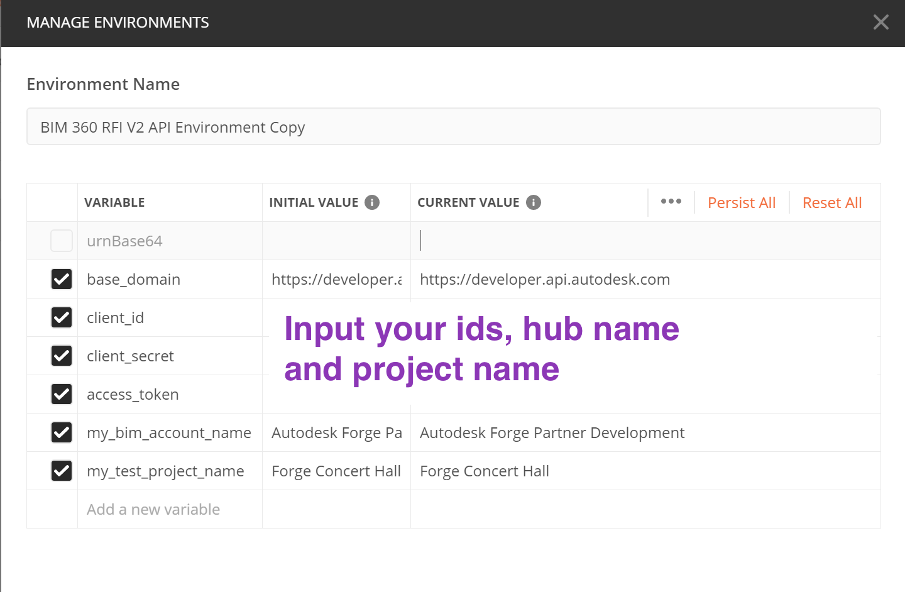
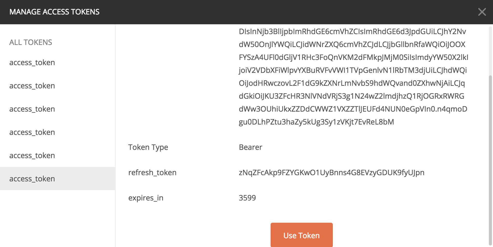
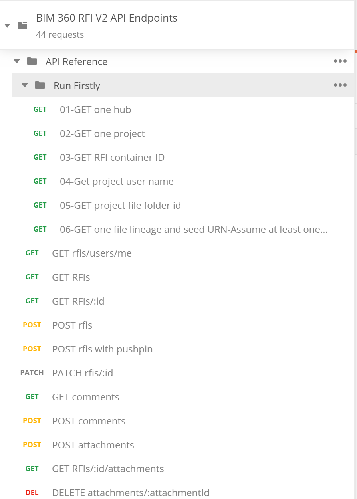

# Postman Collection for BIM360 RFI API 

[](https://www.getpostman.com/)


[](http://opensource.org/licenses/MIT)

## Description

This repository provides demos for [API Reference](https://forge.autodesk.com/en/docs/bim360/v1/reference/http/rfis-v2-rfis-GET/), and demos for [Tutorials](https://forge.autodesk.com/en/docs/bim360/v1/tutorials/rfis/) of RFI API.The scripts of tutorials are not exactly same to the document, while the API logic behind is similar.

## What's Postman?

Postman is a popular tool that provides an easy-to-use interface to send HTTP requests. Postman is able to parse the responses that Forge sends you and save response parameter values to variables. These parameters can then be reused in subsequent requests through these variables. The Postman collections in this repository use this ability to provide pre-populated HTTP requests to help you follow the tutorial workflow with minimal effort. You can also modify the requests and experiment without having to write a single line of code. 

- You can learn how to install and use Postman from [here](https://learning.getpostman.com/docs/postman/launching_postman/installation_and_updates).

- You can download the Postman installer from [here](https://www.getpostman.com/downloads/).


## Setup

1.  **Forge Account**: Learn how to create a Forge Account, activate the subscription and create an app by [this tutorial](http://learnforge.autodesk.io/#/account/). Get Forge _client id_, _client secret_ and  _callback url_. Please register Forge app with the _callback url_ as 

    ```https://www.getpostman.com/oauth2/callback```

2. **BIM 360 Account and project**: must be Account Admin to add the app integration. [Learn about provisioning](https://forge.autodesk.com/blog/bim-360-docs-provisioning-forge-apps). Make a not with the __account name__

3. Ensure **Project Management** module has been activated in BIM 360 project. Make a note with the __project name__ .

4. Ensure **Document Management** module has been activated and one model file has been uploaded to **Project Files** folder.

5.  Clone this repository or download it. It's recommended to install [GitHub Desktop](https://desktop.github.com/). To clone it via command line, use the following (**Terminal** on MacOSX/Linux, **Git Shell** on Windows):

    ```git clone https://github.com/xiaodongliang/forge-bim360.rfi.api-postman.collection```

6. Import the collection and environment files to Postman

7. In environment, input _client id_, _client secret_, _my bim account name_ with __account name__, and _my test project name_ as __project name__


   <p align="center"></p>  

8. In context menu of collection >> **Edit**, switch to the tab **Authorization**. Click **Get New Access Token**, input the variables as below:

   - Grant Type ``Authorization Code``
   
   - Callback URL  ``https://www.getpostman.com/oauth2/callback``

   - Auth URL  ``https://developer.api.autodesk.com/authentication/v1/authorize``

   - Access Token URL  ``https://developer.api.autodesk.com/authentication/v1/gettoken``

   - Client ID ``{{client_id}}``

   - Client Secret ``{{client_secret}}``

   - Scope ``data:read data:write account:read bucket:read``

   - Client Authentication ``Send Client credentials body``

   <p align="center"></p> 
 
 9. Click **Request Token**, it will direct to login Autodesk account, after it succeeds, the token will be generated. Click **Use Token**. Then, click **Update** to close the window of **Edit**

   <p align="center"></p> 
   
   RFI API requires to work with 3-legged token. This collection takes **[Inheriting auth](https://learning.getpostman.com/docs/postman/sending-api-requests/authorization/#inheriting-auth)** to apply 3-legged token to every endpoint in the collection automatically, which means it does not need to input the token in the header explicitly.

## API Endpoints

1. Assume the steps of **Setup** have been performed. The access token is ready.
2. Run the scripts in the folder of **Run Firstly** one by one. It will get RFI container ID and prepare user id and one file lineage urn (for attachment test) and seed urn (for pushpin demo).
   <p align="center"></p> 

3. Play the API scripts. Try to change some parameters or body with more scenarios. 

## Tutorials

1. Assume the steps of **Setup** have been performed. The access token is ready.
2. Run the scripts in the tutorial folder one by one. They can be also tested by [Postman Runner](https://learning.postman.com/docs/postman/collection-runs/starting-a-collection-run/)

## Notes
1. RFI API requires to work with 3-legged token. This collection takes **[Inheriting auth](https://learning.getpostman.com/docs/postman/sending-api-requests/authorization/#inheriting-auth)** to apply 3-legged token to every endpoint in the collection, which means it does not need to input the token in the header explicitly.


## License

This sample is licensed under the terms of the [MIT License](http://opensource.org/licenses/MIT). Please see the [LICENSE](LICENSE) file for full details.

## Written by

Xiaodong Liang [@coldwood](https://twitter.com/coldwood), [Forge Partner Development](http://forge.autodesk.com)
